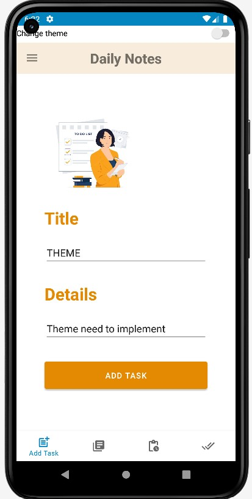

# NoteTaker
Its a to-do note taking app. You will find 4 different screeens like add task input page, see added tasks, see all the pending tasks and also see all the completed tasks. If a task is completed then user will get a notification. Also, user will be able to delete his completed tasks.
### Components used:
  - 4 different Fragments.
  - Bottom Navigation Bar.
  - Shared Preferences on input page and theme page.
  - Menu bar.
  - Recycler View to show the tasks.
  - SQlite for storing data.
  - Notification.
  - Themes (Light and Night).
  
## Input Task page
  Here you will be able to add new task.
    

  
  
## Add task
  You will see all of your added tasks.
    
  
## Pending Task page
  Here you will be able to see all the pending tasks.
    
  
## Completed Task page
  Here you will be able to see all the completed tasks.
  If you want to delete any task then swipe right will delete the task.
    
## Theme
  You have two theme changing options(Night and Light)
    
    
  
## MenuBar
  Here we have 3 different fragments inclusing help, about us, themes.
    
## Shared preference
  Shared preference has been used in the theme section and input task section.
